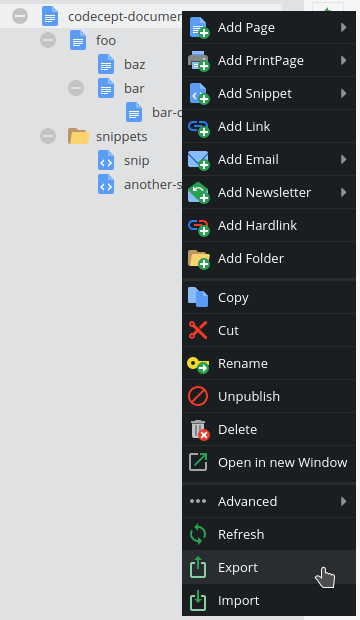

# Pimcore Document Copier
Pimcore bundle for copying documents between environments

**Table of Contents**
- [Pimcore Document Copier](#pimcore-document-copier)
	- [Compatibility](#compatibility)
	- [Installing/Getting started](#installinggetting-started)
	- [Usage](#usage)
	    - [Admin panel](#admin-interface)
	    - [Commands](#commands)
	    - [Limitations](#limitations)
	- [Testing](#testing)
	- [Contributing](#contributing)
	- [Licence](#licence)
	- [Standards & Code Quality](#standards--code-quality)
	- [About Authors](#about-authors)

## Compatibility
This module was tested on:
* Pimcore 6.1.2 @ PHP 7.3
* Pimcore 6.4.2 @ PHP 7.3
* Pimcore 6.5.3 @ PHP 7.3

## Installing/Getting started

Add repository to your project's composer.json:
```json
{
    "repositories": [
        {
          "type": "vcs",
          "url": "ssh://git@gitlab.divante.pl:60022/pdunaj/pimcore-document-copier.git"
        }
      ]
}
```

Install latest version from repo:
```bash
composer require divante/pimcore-document-copier:dev-master
```

Add routing to `app/config/routing.yml`:
```yaml
_documentcopier:
    resource: "@DocumentCopierBundle/Resources/config/pimcore/routing.yml"
```

Enable the bundle:
```bash
bin/console pimcore:bundle:enable DocumentCopierBundle
```

Import example documents:
```bash
bin/console document-copier:import --path=/codecept-document-copier/foo/bar --root=vendor/divante/pimcore-document-copier/app/Resources/test_root --recursiveDepth=2
```

View imported documents in Pimcore admin panel:\


## Usage

### Admin interface

* In document tree, right-click **the document** that you would like to export or import.
* If the document you're importing doesn't exist, first create an empty one with the exact same path and key.
* It is possible to import only a selected document (for example `/codecept-document-copier/foo/bar` with depth `0`) 
even if uploaded ZIP file contains much more assets and documents (for example the entire `/codecept-document-copier` 
exported at depth `10`).



#### Export dialog

Download a zipped export of selected document with or without its dependencies (other documents & assets).


#### Import dialog

Import a ZIP file with or without the dependencies.


### Commands

Commands below are run whenever user requests import / export from admin panel.\
You can also run these commands directly. For example, you may keep your documents in repository and import them during migrations.

#### Export command

```bash
bin/console document-copier:export --path=PATH --root[=ROOT] --recursiveDepth[=RECURSIVEDEPTH]
```
Options:
*  `--path=PATH` **Document path** \
Full path to the document as in admin panel
*  `--root[=ROOT]` **Resources root** [default: `app/Resources`] \
Exported JSONs and assets will be saved to this directory \
Leave this parameter as default unless you need to keep different versions of documents
*  `--recursiveDepth[=RECURSIVEDEPTH]` **Max depth of dependency tree** [default: `0`] \
Keep this number small to avoid accidentally overwriting too many documents \
If `0`, no dependencies (documents & assets) will be exported \
If `1`, only direct dependencies will be exported (child documents, as well as documents & assets referenced in the document) \
If greater than `1`, dependencies and their dependencies will be exported recursively


#### Import command

```bash
bin/console document-copier:import --path=PATH --root[=ROOT] --recursiveDepth[=RECURSIVEDEPTH]
```

Options:
*  `--path=PATH` **Document path** \
*Same as in export command*
*  `--root[=ROOT]` **Resources root** [default: `app/Resources`] \
JSONs and assets will be loaded from this directory. \
File structure in this directory must reflect document and asset trees as in admin panel. \
Leave this parameter as default unless you need to keep different versions of documents
*  `--recursiveDepth[=RECURSIVEDEPTH]` **Max depth of dependency tree** [default: `0`] \
*Same as in export command*


### Limitations

**Data objects** are not handled by this package. Use other methods like CSV export instead.\
Features listed below have not been implemented as of yet (pull requests are welcome!)

Unsupported document types:
* newsletter
* printpage
* printcontainer

Unsupported editable types:
* embed
* pdf
* relation
* relations
* renderlet
* video

Unsupported document settings:
* Content-Master Document
* Target Groups
* HTML-Tags

## Testing

Run tests locally:
```bash
vendor/bin/codecept run -c tests/codeception.dist.yml
```

## Contributing
If you'd like to contribute, please fork the repository and use a feature branch. Pull requests are warmly welcome.

## Licence 
Pimcore Document Copier source code is completely free and released under the 
[GNU General Public License v3.0]({repository_url}/blob/master/LICENSE).

## Standards & Code Quality
This module respects all Pimcore 6 code quality rules and our own PHPCS and PHPMD rulesets.

## About Authors


We are a Software House from Europe, existing from 2008 and employing about 150 people. Our core competencies are built 
around Magento, Pimcore and bespoke software projects (we love Symfony3, Node.js, Angular, React, Vue.js). 
We specialize in sophisticated integration projects trying to connect hardcore IT with good product design and UX.

We work for Clients like INTERSPORT, ING, Odlo, Onderdelenwinkel and CDP, the company that produced The Witcher game. 
We develop two projects: [Open Loyalty](http://www.openloyalty.io/ "Open Loyalty") - an open source loyalty program 
and [Vue.js Storefront](https://github.com/DivanteLtd/vue-storefront "Vue.js Storefront").

We are part of the OEX Group which is listed on the Warsaw Stock Exchange. Our annual revenue has been growing at a 
minimum of about 30% year on year.

Visit our website [Divante.co](https://divante.co/ "Divante.co") for more information.
